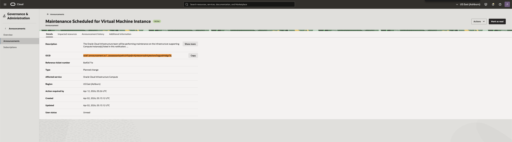
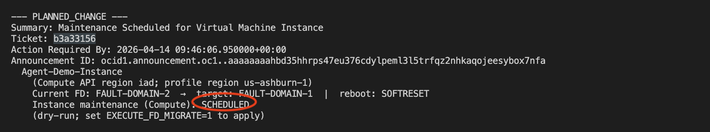
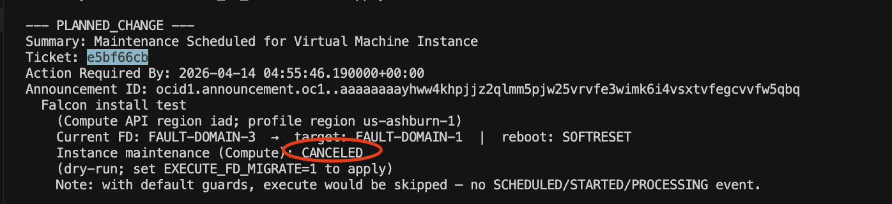
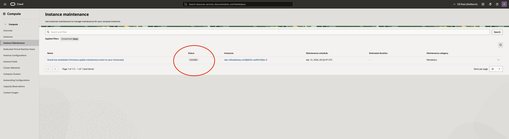
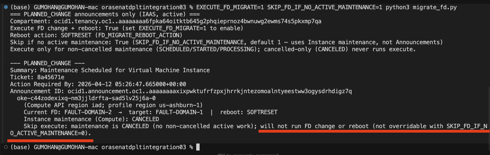

# `migrate_fd.py` — OCI planned change & fault-domain migration

Python utility that lists **active** **IAAS** **`PLANNED_CHANGE`** announcements, then for each affected **compute instance** evaluates **OCI Compute instance maintenance** and optionally moves the VM to another **fault domain** in the same availability domain and **reboots** (`SOFTRESET` / `RESET`).

**Compute maintenance** is the source of truth (announcements can stay open after work is done or canceled). See the script’s module docstring for full behavior.

**Host placement:** In OCI, **hosts that are scheduled for maintenance are closed for placement** until that work completes. **New VMs** are therefore placed on **hosts outside that maintenance window**—for example hosts that are **already upgraded** or **scheduled for a later** maintenance cycle. Fault-domain moves and reboots are one way to get off a host that is in scope for upcoming platform work.

## Run every night (recommended)

Schedule **`migrate_fd.py`** to run **daily** (for example **cron**, **systemd timer**, **Kubernetes CronJob**, or **CI**) so that:

- New **PLANNED_CHANGE** announcements and **instance maintenance** state changes are picked up without relying on manual runs.
- The default **`SKIP_FD_IF_NO_ACTIVE_MAINTENANCE`** behavior avoids repeating fault-domain actions when maintenance is already complete while a **PLANNED_CHANGE** row can still be **ACTIVE**.

Use **dry-run** in automation unless you intentionally set **`EXECUTE_FD_MIGRATE=1`** and accept **`update_instance`** + reboot on matching instances.

Example (**dry-run** once per night at 02:15 — adjust paths and profile):

```bash
15 2 * * * cd /path/to/clone && OCI_CLI_PROFILE=your_profile /usr/bin/python3 migrate_fd.py >> /var/log/migrate_fd.log 2>&1
```

## Requirements

- Python 3.x  
- [`oci`](https://docs.oracle.com/en-us/iaas/tools/python/latest/) Python SDK  
- Valid **`~/.oci/config`**; set **`OCI_CLI_PROFILE`** to your profile.

## Quick start

```bash
pip install oci
export OCI_CLI_PROFILE=your_profile
python3 migrate_fd.py          # dry-run (no API changes)
```

## Execute (real FD change + reboot)

```bash
EXECUTE_FD_MIGRATE=1 python3 migrate_fd.py
```

## Common environment variables

| Variable | Purpose |
|----------|--------|
| **`EXECUTE_FD_MIGRATE`** | `1` / `true` / `yes` to run `update_instance` + reboot; otherwise dry-run. |
| **`SKIP_FD_IF_NO_ACTIVE_MAINTENANCE`** | Default on: skip execute if no `SCHEDULED`/`STARTED`/`PROCESSING` maintenance. Set to `0` to force (never when maintenance is canceled-only). |
| **`FD_MIGRATE_REBOOT_ACTION`** | `SOFTRESET` (default) or `RESET`. |
| **`OCI_COMPARTMENT_ID`** or **`OCI_COMPARTMENT_OCID`** | Limit announcement / maintenance listing scope to a compartment. |
| **`OCI_CLI_PROFILE`** | Config profile name. |

Full details, edge cases, and multi-region behavior are documented in **`migrate_fd.py`** at the top of the file.

## Screenshots (Console / maintenance states)

### Planned change announcement



### Active state



### Cancelled state



### Instance maintenance status — canceled



### No fault-domain change (skip / dry-run)


